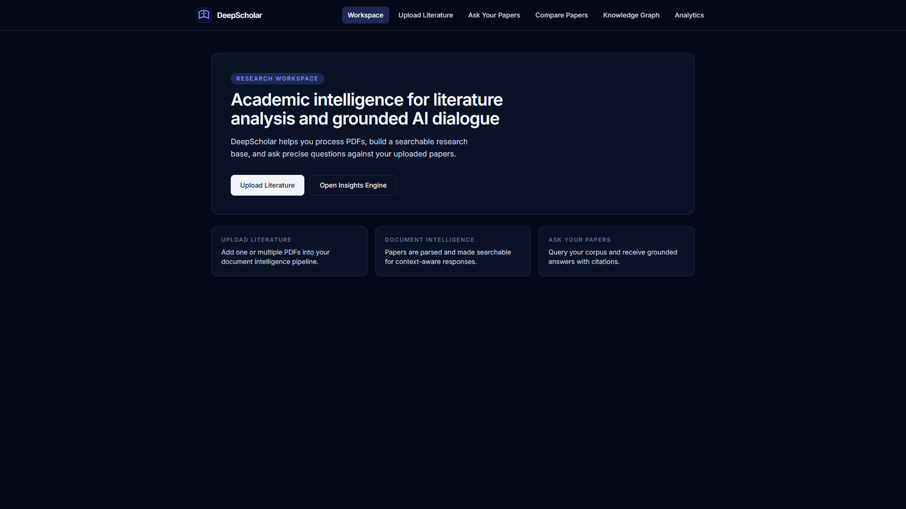
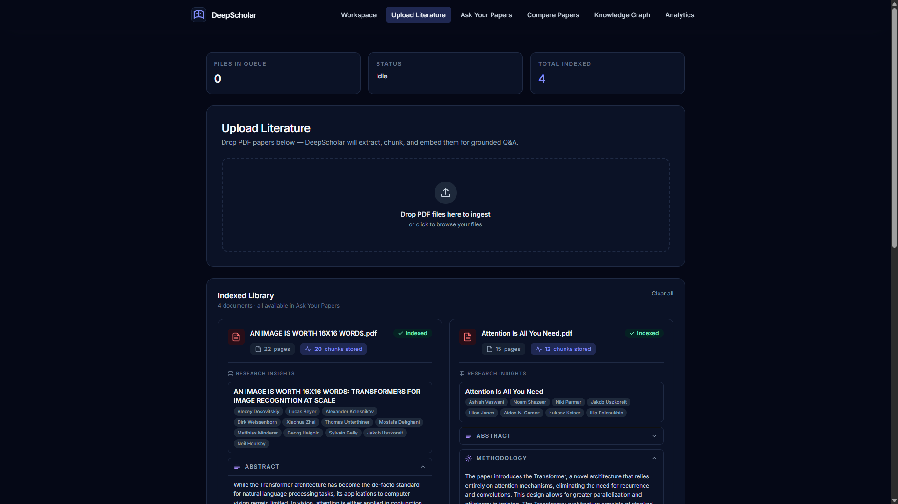
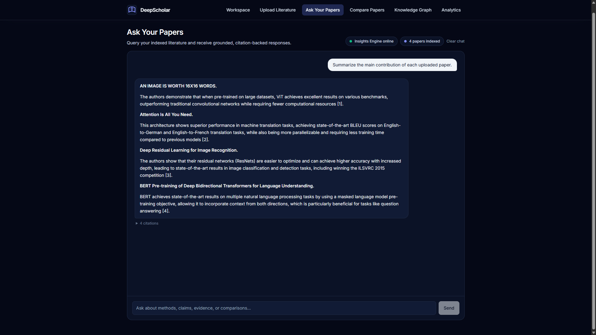
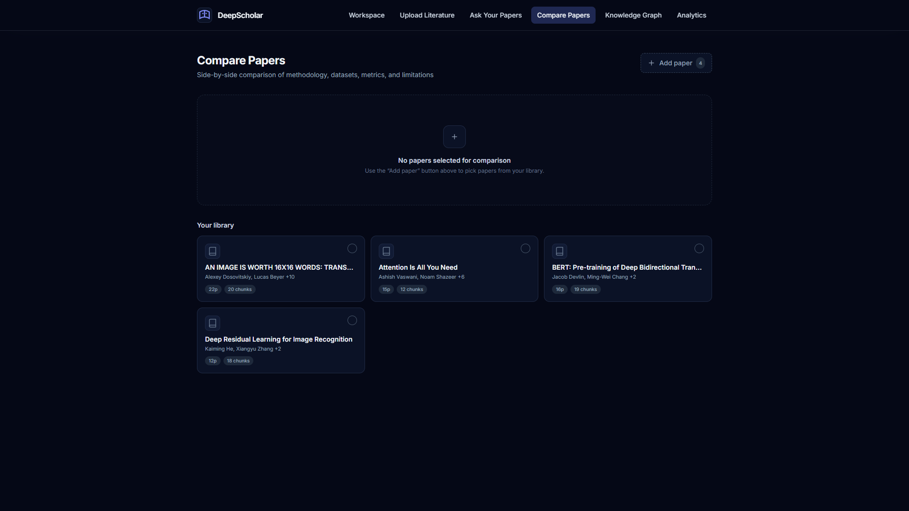
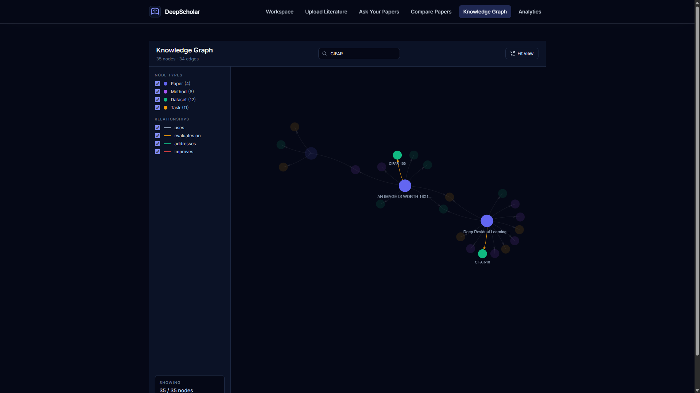
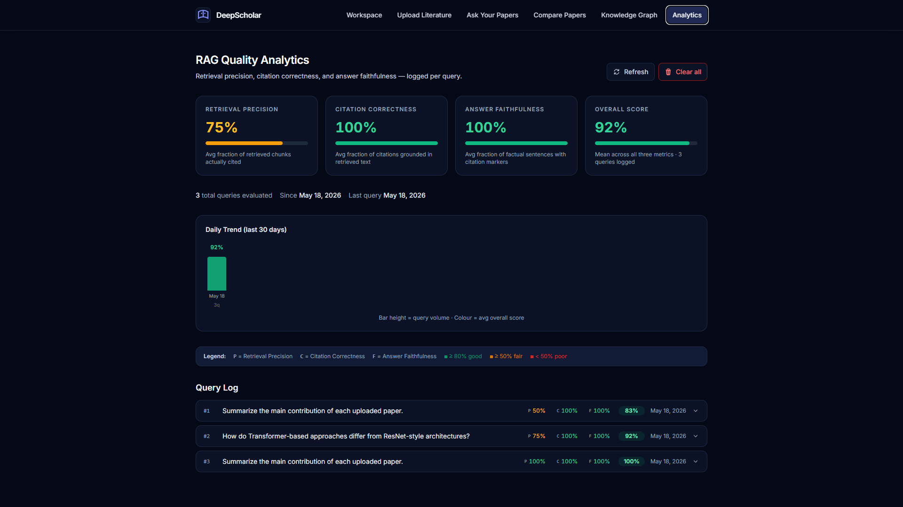

# I Built a Research Workspace Because I Kept Losing Track of My Own Sources

I had been reading into RAG systems and a bit of reinforcement learning on the side, mostly to satisfy my own curiosity. The papers piled up. A few on retrieval, a few on reward modelling, a few that sat awkwardly in between. After a while I had a handful of PDFs open, a notes file with quotes pasted in, and a growing suspicion that I was misattributing things to the wrong authors.

The thing that pushed me over the edge was small. I wrote a paragraph comparing two papers, then realised the quote I had used belonged to a third paper I had read the day before. Fixing it took longer than writing the paragraph in the first place.

The connection felt obvious. The problem I had was literally a retrieval problem, and I had been reading about retrieval all week. So I closed the notes file, made coffee, and started sketching what I actually wanted. Not another notes app. Not a generic chatbot that would happily invent a citation. Something that would let me drop in a folder of papers, ask real questions, and never tell me anything that was not literally written in one of those papers.

That is DeepScholar. The rest of this post is how I built it and why each piece exists.



## The rule everything else follows from

Before writing a line of code I wrote down one rule on a sticky note and put it next to my monitor.

> The system is not allowed to say anything that is not in the retrieved passages, and if it tries to, the post processor strips the sentence before the user sees it.

Every architectural choice in this project is downstream of that sentence. Hybrid retrieval, BM25 reranking, the citation reconciliation pass, the per source coverage check, the faithfulness metric in the analytics dashboard. They all exist because at some point during development I caught the model breaking that rule in a slightly different way, and I needed a structural fix that would prevent it from ever breaking the rule in that same way again.

I have read enough confidently fabricated citations from generic chatbots to know that "the model usually behaves" is not a guarantee you can build a research tool on.

## Ingestion as a real pipeline

The upload endpoint does five things in a fixed order. None of them are optional.

First, magic byte validation. I do not trust the `Content-Type` header on an uploaded file. The first four bytes get checked against the PDF signature before anything else runs. If you have ever had a malformed file blow up your text extraction layer in production, you know why this is the first thing in the pipeline and not the fifth.

Second, PyMuPDF text extraction page by page, keeping page boundaries as metadata. Academic PDFs are genuinely awful to parse. Two column layouts, footnotes that wrap into the next column, tables in the middle of a paragraph, hyphenated words split across line breaks. I have post processing that normalises whitespace, strips repeating headers and footers, and reassembles broken hyphenations. It is the least glamorous code in the project and it is what separates retrieval that works from retrieval that returns word salad.

Third, sentence aware overlapping chunking. Most RAG tutorials chunk on character or token count and call it a day. That is how you end up with half a methodology section ranked highly for a query about that methodology, with the other half ranked too low to make it into the context window. My chunker uses sentence boundary detection, with 1000 token windows and 150 token overlap, and snaps every window boundary to the nearest sentence end. Each chunk carries its source filename, page range, chunk index, and a SHA 256 fingerprint. The fingerprint is what lets me re upload a paper without duplicating any vectors.

Fourth, embeddings. OpenAI's `text-embedding-3-large` at 3072 dimensions, stored in pgvector on Supabase, with an IVFFlat index on cosine distance. At a few hundred chunks this is overkill. At ten thousand chunks it keeps similarity search comfortably under 100 ms.

Fifth, and this is the part that I think actually matters, structured field extraction. For every paper a second LLM call runs in JSON mode and pulls out a typed schema: title, authors, abstract, methodology, methods, datasets, metrics, tasks, prior work the paper improves on, and limitations. Missing data returns `null` or an empty list, never a guess. The schema is validated at the service boundary. If a field comes back malformed, that one field fails independently and the rest are still stored.

This second extraction stage is what powers the compare view, the knowledge graph, and a lot of the retrieval intelligence later in the pipeline. Vector search tells you what is similar to a query. Schema extraction tells you what a paper actually is. They answer different questions and you need both.



## Retrieval is where it gets interesting

The naive version of retrieval over a vector store is one cosine similarity call and a `LIMIT 10`. That works until it does not. Here are the failure modes I hit and what I did about each one.

### Vector only retrieval is bad at rare terms

If someone asks about a specific dataset name like `MS MARCO` or a niche method like `LoRA`, dense embeddings will happily return semantically related chunks that do not actually contain the term. I added a parallel keyword search using PostgreSQL's `to_tsvector` with a GIN index, and fused the two ranked lists with Reciprocal Rank Fusion at `k=60` (the original Cormack constant). RRF is parameter free, requires no score normalisation, and in practice consistently outperforms the linear score combinations people reach for first.

### Hybrid recall is high but precision is mushy

After fusion I have a pool of candidates that are either semantically similar or lexically relevant. To get the final context window right I rerank that pool with Okapi BM25 (`k1=1.5`, `b=0.75`, pure Python, no extra dependencies) and combine BM25 with the normalised vector score:

```
final = 0.4 * norm_vector + 0.6 * norm_bm25
```

The 60/40 weighting slightly favours lexical precision, which is the right bias for grounded question answering because chunks that literally contain the query terms are easier to cite without ambiguity.

### Multi paper queries silently drop documents

This one took me a while to notice. If you ask "compare the methodologies of each paper", a global hybrid search will over represent whichever paper happens to share the most vocabulary with the query, and quietly leave one or two indexed papers out of the context entirely. The model then writes a "comparison" that secretly only covers two of the four papers in the corpus.

The fix is a regex based intent classifier that detects multi paper questions ("summarise each", "compare", "differences between", and so on) and flips the retrieval path. Instead of one global top K, it runs a top K per indexed source independently, then merges. Every paper is guaranteed at least its best K passages in the candidate pool.

After reranking I do one more pass to check that every paper in scope has at least one passage in the final context window, and back fill any missing source with its single best hybrid match. This runs after reranking on purpose, so the surviving high quality passages are never displaced.

### Generation is where citation discipline lives

The grounded generation call uses `gpt-4o-mini` at temperature 0 with `response_format=json_object`. The system prompt has seven hard rules: context only, cite every factual claim, no uncited synthesis, refuse gracefully when context is insufficient, citation fidelity (do not paraphrase past what the passage actually says), JSON envelope with a markdown body, and a strict multi document layout (one paragraph per paper, bold paper title heading, citations restricted to chunks from that paper).

Even with that prompt, models occasionally emit `[N]` markers in the prose that disagree with the `citations` array they return alongside. The parser ignores the model's citation list and rebuilds it from the markers actually present in the answer, then renumbers everything to `[1]`, `[2]`, `[3]` from one. The inline markers and the citation panel cannot disagree because they come from the same source of truth.

A final defence in depth pass walks every sentence in the answer. If a sentence looks factual (length above a threshold, not a heading, not a transitional opener) but has no `[N]` marker, the sentence is stripped before the user ever sees it. Belt, braces, and a second belt.



## The compare view came almost free

Once the per paper structured extractions exist, the comparison view is just a join. You pick the papers you want from the global store, and the page renders a fixed row, variable column table with one column per paper and rows for methodology, datasets, methods, metrics, and limitations. No LLM call at render time. The extraction during ingestion did all the work. Beyond three papers the table scrolls horizontally instead of collapsing columns, because a layout that breaks at four documents is not a layout.

This is one of those features that feels almost trivial in retrospect, but it only works because of a decision I made very early on, which was to spend the extra ingestion time pulling out structured metadata even though I had no immediate use for half of it.



## Knowledge graph from the same data

The structured extractions also let me build a typed knowledge graph for free. Nodes are papers, methods, datasets, and tasks. Edges are typed: `uses`, `evaluates_on`, `addresses`, `improves`. I render it with `react-force-graph-2d`. You can filter by node type or edge type, click a node for its metadata, drag to rearrange, zoom in on a cluster.

This was the feature I was most worried would feel like a gimmick, and it is the one I end up using most when I am exploring a new area. Seeing that three different papers all sit on the same dataset and improve on the same prior work tells you something about a sub field that you would not get from reading their abstracts back to back.



## Measuring what is actually happening

A research tool that might be wrong is worse than no tool at all, because you will use it anyway. So every chat response gets scored on three metrics, synchronously, and the result is logged to Postgres.

**Retrieval precision** is the fraction of retrieved chunks that ended up cited in the final answer. For multi paper queries it falls back to source level coverage so that the very mechanism that prevents skipping documents (sending more candidates per paper than the answer needs) does not get punished.

**Citation correctness** checks whether the tokens of each citation the model emitted actually appear inside the chunk it was attributed to. The check is coverage based rather than Jaccard, so a short accurate excerpt against a long chunk does not get unfairly penalised.

**Answer faithfulness** is the fraction of factual sentences in the answer that carry at least one `[N]` marker. Sentences that fail this test are exactly the ones the defence in depth pass strips, so this should sit near 1.0 in practice. When it drops I want to know.

The dashboard at `/analytics` shows the rolling averages, a 30 day daily trend, and a paginated log of every single query the system has ever answered. If a regression sneaks in (say I change a retrieval parameter), I see it on the trend line within a few queries.



## The boring engineering choices that matter

A few decisions that look small but I want to call out:

The frontend state lives in a Zustand store mounted via a thin `"use client"` providers wrapper in `layout.tsx`, because the App Router root layout is a server component. State rehydrates from localStorage on mount, so uploaded papers survive a hard refresh. Every page reads from the same store, no page owns the document list. The state outlives the component tree.

Upload progress uses `XMLHttpRequest` instead of `fetch`, specifically because I need `onprogress` events. Progress is tracked per filename in a reducer, not as a single scalar. If you are uploading five papers at once, each one has its own progress bar showing its actual state, not an average that hides one file stalling at 40 percent.

The single cached psycopg2 connection in `vector_store.py` is fine for the demo and for one Uvicorn worker. The README is honest about that. Swapping it for a `ThreadedConnectionPool` before deploying with multiple workers is a 20 line change. I just have not needed it yet.

I built the whole thing assuming I would be the only user. That meant I could skip auth, skip multi tenant isolation, skip the entire ops side. The flip side is that every minute I saved on those got spent on the retrieval quality and the citation discipline, which is where I wanted to spend the time anyway.

## What I would build next

The list, in roughly the order I would actually ship it:

1. Connection pooling so the backend scales past one worker.
2. Streaming answers from `/chat` over Server Sent Events. The frontend already shows a typing indicator, so most of the work is already done.
3. A follow up question mode that uses the previous turn's retrieved chunks as a tie breaker for the current turn.
4. A local only mode using `sentence-transformers/all-MiniLM-L6-v2` for embeddings and a `llama.cpp` served Mistral for generation, for anyone who cannot send papers to a hosted API.
5. Cross encoder reranking as an optional second stage when the latency budget allows.

None of those are speculative. The ingestion schema was designed with them in mind, which was the point of spending the time on the architecture up front.

## The thing I keep coming back to

Halfway through building this I noticed I had started using it for my actual reading, not just for testing. That was the moment I stopped writing the project as a portfolio exercise and started writing it as a tool I wanted to keep. There is a real difference between code you wrote because you wanted something on a CV and code you wrote because you needed it and nothing on the market did the thing you wanted in the way you wanted it.

The trust constraint is what made it feel like a tool. If I had let myself ship a version where the citations were vibes based, I would have stopped using it inside a week, the same way I stopped using every other research chatbot I tried before I decided to build my own.

You can read every line of code on GitHub. If you use it, tell me what breaks.
